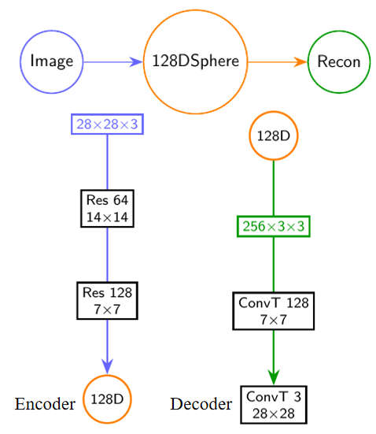

# 🌀 Riemannian Flow Matching (RFM) on General Geometries

We study Riemannian Flow Matching on Stacked-MNIST, CIFAR-10, Tiny-ImageNet-200 using hyperspherical, hyperbolic, and toroidal latent manifolds, each equipped with an autoencoder and classifier.

> **Generative Modeling on High-Dimensional Non-Euclidean Manifolds** — a unified Flow Matching framework enabling efficient generation and reconstruction on complex geometries such as spheres, hyperbolic spaces, and tori.

---

## 📖 Detailed Task Description

### **Task Pipeline Overview**


---

### **Data Construction – Stacked-MNIST**
- Randomly select three digits and assign each to an RGB channel.


---

### **Manifold Mapper Architecture**
#### Stacked-MNIST


#### CIFAR-10


#### Tiny-ImageNet-200


---

### **Generation Results on Different Manifolds**
#### Hypersphere


#### Hyperbolic


#### FlatTorus (UMAP 2-D Visualization)


---

### **CIFAR-10 Generation & Reconstruction on Hypersphere**
- **Reconstruction**


- **Random Generation**


---

### **Tiny-ImageNet-200 Experimental Results**
- **Reconstruction (128-D Latent)**


- **Reconstruction (256-D Latent)**


- **Random Generation**


---

## 📂 File Structure
```bash
├── Datasets-Stacked_MNIST/        # Datasets (Stacked-MNIST; CIFAR-10 and Tiny-ImageNet-200 not included)
├── Auto-Encoder/                  # Encoder / Decoder
├── Classifier/                    # Classifiers
├── Riemannian-Flow-Matching/      # RFM code
├── images/                        # README figures
└── README.md
```